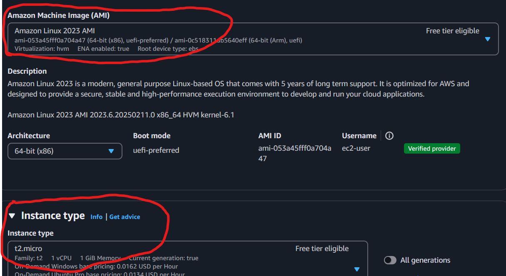
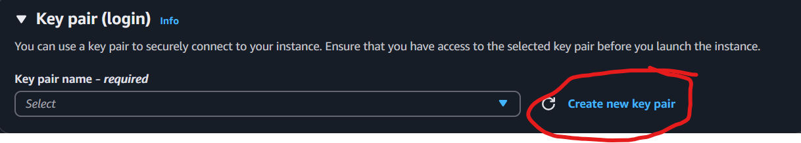
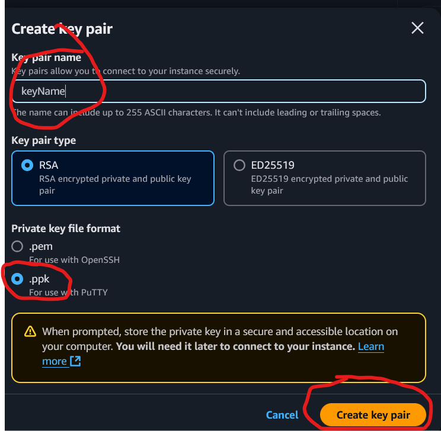

# Cloud Infrastructure
The cloud service we used in this class was Amazon's AWS. After logging into the account we formatted the instance we wanted by lauching it with selecting Amazon Linux 2 AMI, t2.micro, and created a security key.

This is what youll see when you click "launch instance"

Then you'll want to create a keypair if you're planning on remotely accessing it.

You can remotely access this using an application like putty, you would put the Public IPV4 DNS at the IP address on putty, and if you created a keypair you'd need to navigate on putty to connection > SSH > AUTH > Credentials and brows to your public key pair that was generated.

[Home Page](index.md)