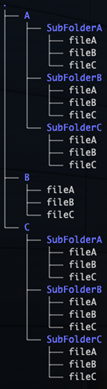

# Linux Fundementals
A Linux environment is best used for DevOps, because it’s open-source, very secure, and has a strong command line interface. It being out as long as it’s been out, means that there is a ton of tools that align with the DevOps mindset. You can also easily automate procedures and continuous integrations.

Commands:
ls -lists all of the items visible to you without permissions. Adding the -la flag will let you see ALL the files, even hidden ones

cd -is change directory, like many command lines you just use "cd directoryName" and it will tak you there. Use "cd ~" to take you to the home directory.

touch fileName.extention -this will create a file in your current directory an example would be "touch final-project.txt" this will create a text file named final-project.

vi file -this will open the file in a text editor inside the commant line interface. Pressing the "i" key will allow you to make changes. Whe you are done press ESC and then you can use ":wq" to write and quit. Or ":q!" to force quit without saving

mkdir directoryName -this will create a folder in the current directory you are in. Nameing it whatever you put in as directoyrName.

cp -is the copy command, to copy files or folders to other places for example "cp file1 file2" this will copy file 1's content to a new file called file2

rm -is remove, "rm file1 file2" will remove files 1 and 2. To rm a folder you need to add the -d flag for directory. If a directory has files it won't let you delete it unless you add the -rf flag. This means recursive(go though the folder) force.

Now install tree like this:
sudo dnf -y install tree

The command "tree" will display the files in your directory in an easy to read format. Using the commands above create this 

[Home Page](index.md)